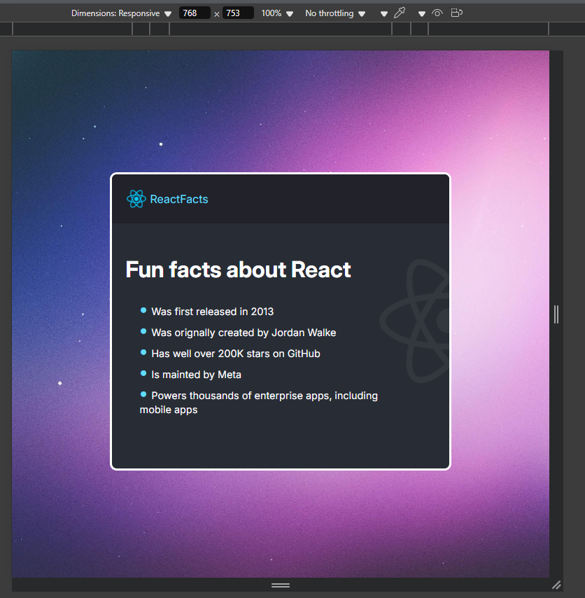

# React Facts StaticPage
Static Page using React - Challenge Section 1 of FreeCodeCamp React Tutorial

This is a solution to the [Challenge Project for Section 1 of Freecodecamp's React Tutorial on youtube](https://www.youtube.com/watch?v=x4rFhThSX04&t=6593s). 

## Table of contents

- [Overview](#overview)
  - [The challenge](#the-challenge)
  - [Screenshot](#screenshot)
  - [Links](#links)
- [My process](#my-process)
  - [Built with](#built-with)
  - [What I learned](#what-i-learned)
  - [Continued development](#continued-development)
  - [Useful resources](#useful-resources)
- [Author](#author)
- [Acknowledgments](#acknowledgments)

## Overview

### The challenge

Create a React app using Vite. Display React Facts by creating components and use composition to stitch up the page

### Screenshot
- Desktop View

- Tablet View

- Mobile View


### Links

- Solution URL: [Git Repo Link](https://github.com/Mayank926/ReactFactsStaticPage)
- Live Site URL: [Hosted solution link](https://mayank926.github.io/testimonials/)

## My process

### Built with
- React 19.0.0
- Vite 6.3.1

### What I learned

- Learned how to create react app using Vite and run in local
```sh
    npm create vite@latest
    # cd into project directory
    npm install
    npm run dev
```
- Learned about createRoot from react-dom/client library as start point of React
```js
import {createRoot} from 'react-dom/client';
import App from './App';

const rootNode = createRoot(document.getElementById("root"));

rootNode.render(<App/>);
```
- Learned how to have componenets in their own files and import

```js
import Main from "./components/Main";
import Navbar from "./components/Navbar";

const App = () => {
  return (
    <div className="container">
      <Navbar />
      <Main />
    </div>
  );
};

export default App;
```

- Learned that export without default should specify the items to be exported
 ```js
export {App}
 ```

- Learned to use css property overflow to not allow child elements to peek out
```css
overflow: hidden;
```

- Learned the use of fragment to have parent element for combining HTML elements in one React component
 ```HTML
<>
    <head>
    </head>
    <body>
    </body>
</>
 ```